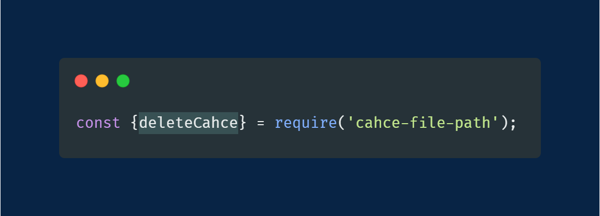
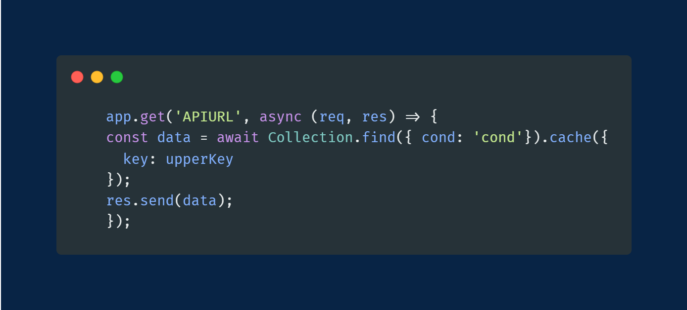
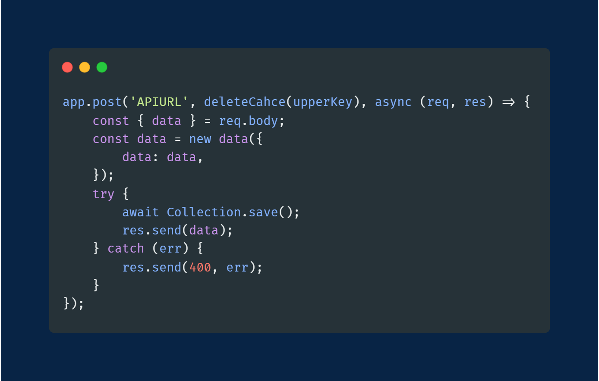

# Reusable-Methods

## Cach File

It automates redis caching by overwriting the `mongoose.Query.prototype.exec` function.
It also has an option to either cach the data or not by chaining cach function to the query.
Cach function has an optional object argument to provide customized upper key.
You can also use deleteCahce middel ware to clear cached data manualy by providing the upper key

### Using cach file

-   require cach file
    

-   chain cach function to the query (you dont have to provide an upper key and all data will be stored in the same cluster)
    

-   delete cach
    

[LinkedIn](https://www.linkedin.com/in/ahmed-abdelgaber/)
